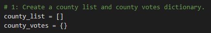
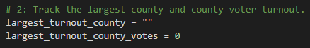
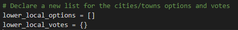
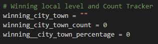

# Election_Analysis
## Overview of Election Audit
Tom, a Colorado Board of Elections employee has given me the following tasks to complete the election audit of a recent local congressional election.

1. Reporting the total number of votes cast.
2. Get a complete list of candidates who received votes.
3. Calculate the total number of votes each candidate won.
4. Calculate the percentage of votes each candidate won.
5. Determine the winner of the election based on popular vote

Additionally, the election commission has requested some additional data to complete the audit:

1. The voter turnout for each county
2. The percentage of votes from each county out of the total count
3. The county with the highest turnout

The python code created will automatically count the number of votes, identify the different candidates and counties, and calculate the number and percentage of votes for each candidate and county. As a result of using this code, the Board of Elections will save time from execution and reduce human errors by avoiding to enter formulas in excel manually.

## Resources 
- Data Source: election_results.csv
- Software: Python 3.7.6, Visual Studio Code 1.53.2

### Election-Audit Results
The code's summary output of the election is shown below:

According to the analysis of the election:
* There were 369,711 votes cast in the election.
* The counties that participated in the congressional election were:
    - Jefferson
    - Denver
    - Arapahoe 
 
    Their respective election results are the following:

    

* The county with the largest number of votes was Denver, with a 82.8% of the total votes
* There were three candidates in the election and they were:
    - Charles Casper Stockham
    - Diana DeGette
    - Raymon Anthony Doane
* The candidate results were the following:
    
    

* The winner of the election was:
    - Diana DeGette, who received 73.8% of the total votes and 272,892 number of votes. 

### Election-Audit Summary

The purpose of this code is to automatically count the total number of votes, identify the candidates and the counties in an election, and calculate their respective votes and percentages. 

The election commission could use this code not only for other future U.S. Congressional districts elections but also for senatorial districts and local elections. Before automating this process using this code, this job was normally done in excel which is prone to human error and takes longer time to execute and review, especially when the dataset gets larger. By using this code, it is possible to instantly determine the candidates in an election, counting their votes and calculating their percentages of the votes without any errors and regardless of the size of the dataset.

This script can be modified for any election by changing the summary output in both the command line and the text file. As shown in the image below, 

lists and dictionaries used to store values. As shown in the image below, many of the variables are named by the areas where the elections were conducted. For instance, instead of calling them "county", it would be better to use a general name such as "area" or readjust the name according to the election conducted. This should be done to avoid confusion when reading or debugging the code in the future. 

Another way this script could be adapted for broader elections such as the senatorial election is by adding more layers into which the information could be filtered. For instance, in a senatorial election, it would be helpful to not only show the election results in a local county-level but also show the information in cities or towns levels. This information would be helpful in seeing the popular vote composition in a local level and predicting future elections. Nevertheless, depending on the state, the code has to be adjusted depending on the governmental system in each state, since not all states have the same composition. For instance, the entire local government exists at the local township level in Massachussetts or in Virginia where cities are completely separate entities from counties. 

For the new code, additional list and dictionary will be created to store the names of the cities and towns and their respective votes. The winning city or town variable, count and percentage will be initialized to be empty or zero so that they could be populated in the for loop with the correct winning information.

