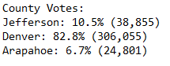

# Election_Analysis
## Overview of Election Audit
A Colorado Board of Elections employee has given me the following tasks to complete the election audit of a recent local congressional election.

1. Calculate the total number of votes cast.
2. Get a complete list of candidates who received votes.
3. Calculate the total number of votes each candidate won.
4. Calculate the percentage of votes each candidate won.
5. Determine the winner of the election based on popular vote

## Resources 
- Data Source: election_results.csv
- Software: Python 3.6.4, Visual Studio Code 1.53.2

### Election-Audit Results
The analysis of the election show that:
* There were 369,711 votes cast in the election.
* The counties that participated in the congressional election were:
    - Jefferson
    - Denver
    - Arapahoe 
 
    Their respective election results are the following:

    

* The county with the largest number of votes was Denver, with a 82.8% of the total votes
* There were three candidates in the election and they were:
    - Charles Casper Stockham
    - Diana DeGette
    - Raymon Anthony Doane
* The candidate results were the following:
    
    

* The winner of the election was:
    - Diana DeGette, who received 73.8% of the total votes and 272,892 number of votes. 

### Election-Audit Summary